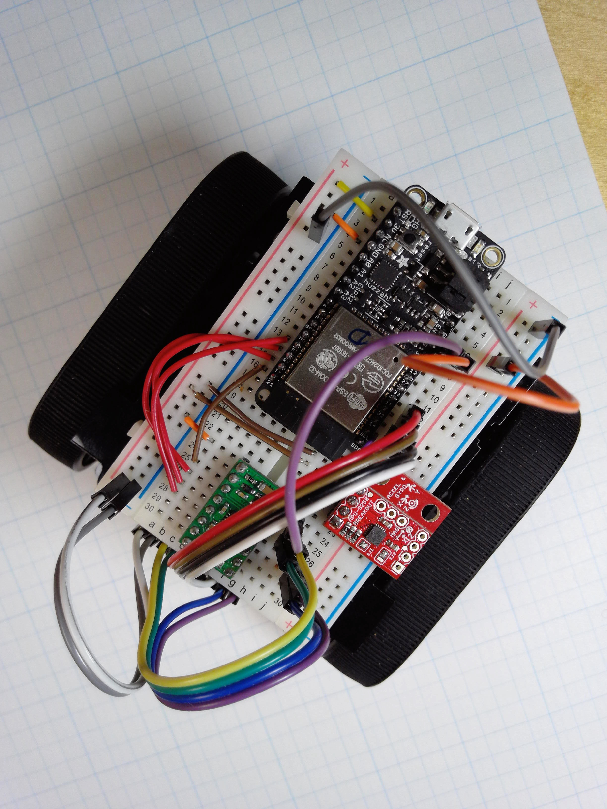
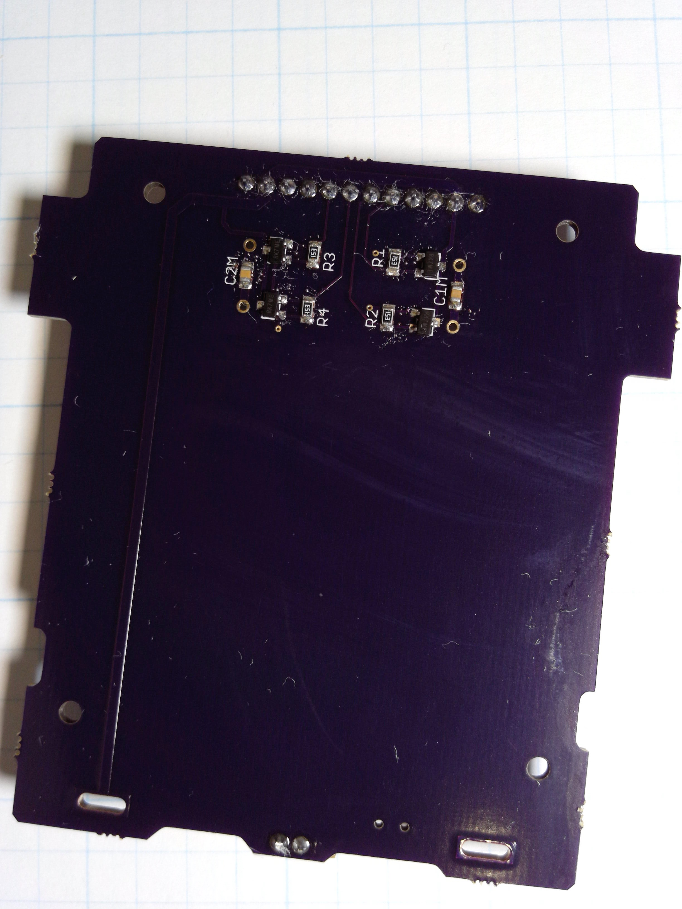

# Zumo Shield 

PCB shield design for the [Pololu]() [Zumo Robot Chassis](https://www.pololu.com/product/1418) in [Eagle CAD](https://www.autodesk.com/products/eagle/overview).

Alternative to circuit boards from Pololu when you want to design your own electronics. The following features are included on the board:

* Cutouts and solder tabs for the battery
* JP1 power "switch"
* JP2 header to microcontroller
* Motor caps (smd components)
* 4 magnetic sensors (smd components)

The board has been successfully fabricated by [OSH Park](https://oshpark.com). If you use a different PCB fab, make sure that it will cut out the "holes" for the battery tabs (VBAT+ and VBAT- on the PCB layout).

*Acknowledgement:* many thanks to Polou for providing a cad file with the locations of the holes and mag sensors of the Zumo.